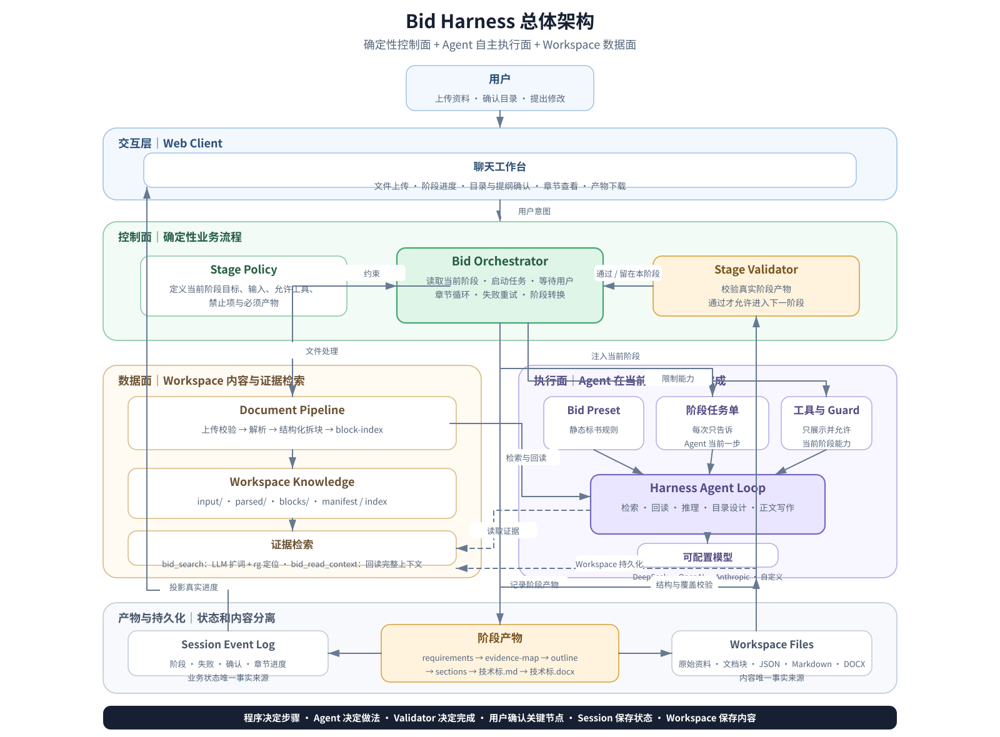

# Bid Harness 总体架构

[English](bid-overall-architecture.md) | 中文

> **总指导思想：程序决定现在做哪一步，Agent 决定这一步具体怎么做，Validator 决定这一步是否完成，用户确认关键业务节点。**



## 核心职责边界

| 角色 | 负责 | 不负责 |
|---|---|---|
| Web Client | 上传资料、展示进度、目录确认、正文查看、产物下载 | 判断阶段、组织生成流程 |
| Bid Orchestrator | 阶段状态、任务注入、工具限制、失败重试、章节循环、用户等待 | 内容理解和正文写作 |
| Agent | 当前阶段内的检索、阅读、推理、目录设计与写作 | 自行跳转阶段、修改业务状态 |
| Validator | 校验阶段产物是否完整、合法、覆盖要求 | 代替 Agent 生成内容 |
| Document Pipeline | 文档解析、结构化拆块、索引、上下文定位 | 使用 LLM 总结或压缩资料 |
| Session Event Log | 保存阶段、失败、确认和进度等业务事实 | 保存大体积正文 |
| Workspace | 保存原始资料、文档块、阶段产物和最终文件 | 决定流程状态 |

## 固定大阶段

```text
文件接入与拆块
→ 提取招标要求和原子评分项
→ 搜索资料并建立评分证据映射
→ 生成详细目录和每章提纲
→ 用户确认目录
→ 按章节编写正文
→ 整书评分覆盖与事实审核
→ 确定性导出 DOCX
```

大阶段由 `Bid Orchestrator` 强制控制，不允许跳过。每个阶段内部仍由 Agent 自主决定检索词、资料阅读顺序、二次搜索和内容组织方式。

## 关键不变量

1. **Agent 的回复不是完成凭证。** 只有阶段产物通过 Validator，Orchestrator 才进入下一阶段。
2. **Agent 无权修改阶段。** 阶段转换只能由 Orchestrator 执行。
3. **搜索命中不是证据。** DSH 原生 `grep` 只定位候选块，Agent 必须通过 `read` 回读命中块；需要上下文时读取 `chunks/index.json` 后继续读取相邻块。
4. **评分要求贯穿全过程。** 评分项同时指导检索、目录覆盖、章节写作和整书审核。
5. **状态与内容分离。** Session Event Log 保存业务状态，Workspace 保存资料和产物。
6. **文档处理确定性。** 上传、解析、拆块、索引和 DOCX 导出均由程序完成，不依赖模型临场发挥。
7. **前端不承载业务逻辑。** 前端只提交用户意图并展示 Host 的真实状态。
8. **只保留一条写作链路。** 新增模式、搜索能力和旧标书复用必须扩展现有阶段或工具，不得复制另一条生成流程。

## 阶段运行模型

```text
Orchestrator 读取当前阶段
        ↓
注入本阶段任务单与工具限制
        ↓
Agent 自主搜索、阅读、推理和写作
        ↓
Agent 提交结构化阶段产物
        ↓
Validator 校验
   ┌────┴────┐
   │         │
 失败        通过
   │         │
留在本阶段   进入下一阶段
并注入错误   或等待用户确认
```

## 项目扩展原则

后续增加公开搜索、历史标书复用、章节改写、模板导出或企业知识库时，应优先扩展：

- 阶段内部工具
- Bid Agent Preset
- Stage Policy
- Validator
- Document Pipeline
- Artifact 类型

除非现有扩展点无法实现，否则不得修改 Harness Agent Loop，也不得新建平行的标书生成链路。
